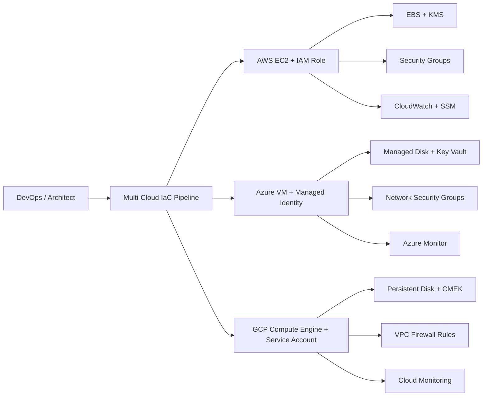

# multi-cloud-compute-architecture<!-- Banner -->
<p align="center">
  
</p>

<h1 align="center">☁️ Multi-Cloud Compute Architecture</h1>
<h3 align="center">AWS EC2 • Azure Virtual Machines • GCP Compute Engine</h3>

<p align="center">
Built by <b>Ola Omoniyi (Olagoldstx)</b> — SecureTheCloud.dev  
</p>

<p align="center">
  <a href="#"></a>
  <a href="#"></a>
  <a href="#"></a>
  <a href="#"></a>
</p>

---

## 🌍 Overview

This repository is the **official SecureTheCloud multi-cloud compute course**, teaching you how to design, secure, automate, and deploy compute resources across:

- **AWS EC2**
- **Azure Virtual Machines**
- **GCP Compute Engine**

This course blends:

- 📘 Textbook-style theory  
- 🧪 Hands-on labs  
- 🛡️ Security hardening  
- 🏗️ Terraform multi-cloud automation  
- 🎓 Advanced architecture patterns  
- 🧩 Zero-trust compute engineering  

Everything is deployed using your live cloud accounts:

| Cloud | ID |
|-------|-----|
| **AWS Account ID** | `764265373335` |
| **Azure Tenant ID** | `776f9ea5-7add-469d-bc51-8e855e9a1d26` |
| **Azure Subscription** | `501c458a-5def-42cf-bbb8-c75078c1cdbc` |
| **GCP Project ID** | `caramel-pager-470614-d1` |
| **GCP Project Number** | `973064685337` |

---

## 📚 Course Structure

### **1. Theory (Textbook Style)**
Located in: `docs/theory/`

1. Compute Fundamentals  
2. Identity on Compute  
3. Network Security  
4. Encryption & KMS  
5. OS Hardening & Patching  
6. Monitoring & Runtime Security  
7. Multi-Cloud Zero-Trust Compute Architecture  

---

### **2. Hands-On Labs**

Located in: `labs/`

- **AWS EC2** (private, encrypted, IAM role, SSM)
- **Azure VM** (Managed Identity, Key Vault, NSG)
- **GCP Compute Engine** (Service Account, CMEK, firewall lockdown)

Each lab includes:

✔ CLI commands  
✔ Terraform option  
✔ Validation steps  
✔ Architecture diagram  
✔ Security checks  
✔ Troubleshooting  

---

### **3. Terraform Multi-Cloud Deployment**

Located in: `terraform/`

- `modules/aws-ec2/`
- `modules/azure-vm/`
- `modules/gcp-compute/`
- `stacks/multi-cloud-deployment/`

Deploy all compute resources with one command:

```bash
terraform init
terraform apply

---

🧠 Architecture Diagram (High-Level)



---
🔐 Security Features Implemented
Identity

EC2 IAM Role

Azure Managed Identity

GCP Service Account

Networking

Private subnets only

No public IP

Zero-trust firewall rules

Encryption

AWS KMS

Azure Key Vault + DES

GCP CMEK

Hardening

CIS benchmark baseline

SSM / Azure Update Manager / GCP Patch Jobs

Agent installation (monitoring)

---

📦 Folder Structure
multi-cloud-compute-architecture/
├── README.md
├── docs/
│   ├── theory/
│   ├── diagrams/
│   ├── binder/
│   └── branding/
├── labs/
│   ├── aws/
│   ├── azure/
│   └── gcp/
└── terraform/
    ├── modules/
    │   ├── aws-ec2/
    │   ├── azure-vm/
    │   └── gcp-compute/
    └── stacks/
        └── multi-cloud-deployment/

🎓 Who This Course Is For

Cloud Security Engineers

Cloud Architects

DevSecOps Engineers

IAM Engineers

SRE / Platform teams

SOC / Blue Team analysts

Anyone preparing for advanced cloud interviews

⭐ Support the Project

If this repository helps you grow in cloud security:

Give it a ⭐ on GitHub!

👨‍💻 Author

Ola Omoniyi (Olagoldstx)
Founder — SecureTheCloud.dev
